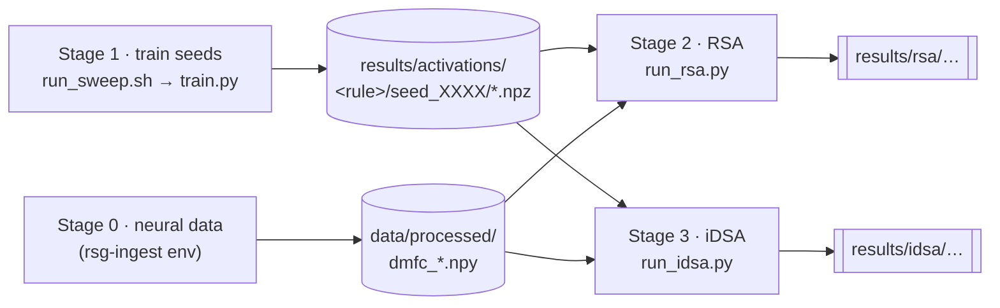

# RUNBOOK — full training + comparison run

How to take the two-prior RSG pipeline end to end: train BPTT and PC seeds, extract
latents, and compare each to macaque DMFC with RSA (geometry) and iDSA (dynamics).
Seeds are the unit of evidence — always run several per rule.



## Environments

Two envs, joined only by files on disk (AGENTS.md "Dependency fragility"). **Neither is
in the repo** — both are rebuilt per machine, and `data/processed/` is gitignored, so a
fresh clone has to do this first. Verified 2026-07-21 on macOS arm64.

| Env | Has | Used for |
| --- | --- | --- |
| `.venv` (repo-local, Python 3.9+) | torch, **neurogym**, **rsatoolbox**, matplotlib, pytest | **Stages 1–3** train + compare — *use this* |
| `rsg-ingest` (conda, **Python 3.11**) | dandi, pynwb, nlb_tools (numpy<2, pandas<2) | **Stage 0** neural ingestion only |

Build the modeling env (prefer a **native arm64** interpreter — under Rosetta everything
below is several times slower):

```bash
python3 -m venv .venv                                  # a native arm64 python3
.venv/bin/pip install "numpy<2" scipy pyyaml matplotlib pytest torch rsatoolbox neurogym
.venv/bin/pip install -e .
.venv/bin/python -m pytest tests -q                    # expect 74 pass / 1 fail / 1 skip — see Gaps
```

Build the ingestion env. **Python 3.11 is required, not optional**: the DANDI server
rejects clients older than 0.74.0, and dandi ≥0.74 needs Python ≥3.10, so a 3.9 env fails
the download with `Client version ... is too old!`.

```bash
conda create -y -n rsg-ingest python=3.11
ENVP=$(conda info --base)/envs/rsg-ingest
$ENVP/bin/pip install "numpy<2" "pandas>=1.4,<2" pynwb dandi pyyaml scikit-learn
$ENVP/bin/pip install --no-deps nlb_tools           # bypass its stale pandas<=1.3.4 cap
```

Run every command **from the repo root**.

---

## Stage 0 — neural data

`data/processed/` is gitignored, so **build it on every fresh checkout**. The `dandi`
CLI must be on `PATH` — `build_neural` shells out to it, so calling the env's python
directly is not enough:

```bash
ENVP=$(conda info --base)/envs/rsg-ingest
PATH="$ENVP/bin:$PATH" $ENVP/bin/python -m src.data.build_neural --out-dir data/processed
```

~45 s including the 15.7 MB DANDI download. Writes `dmfc_rsg.npy` `[20,150,54]`,
`dmfc_inputs.npy` `[20,150,3]`, `dmfc_rsg_splits.npy` `[2,20,150,54]`, `dmfc_meta.json`.
Expect `resolved 983/1160 trials into 20 conditions`, 33–74 trials per condition.

*Validated:* the monkey's own tp-vs-ts slopes recovered from `dmfc_meta.json` reproduce
the published Bayesian signature — short 1.08/0.72 (eye/hand), long 0.87/0.59, i.e. long
flatter than short. Use these as the target the model side should match.

## Stage 1 — train seeds  (uses `.venv`)

One seed per invocation; `scripts/run_sweep.sh` loops rules × seeds (the local
equivalent of a SLURM job array). Each seed is independent — a failure doesn't abort
the sweep; failures are listed at the end to re-run.

**Reduced smoke first** — CPU, fast, *under-trains on purpose* (flat behavior/weak
signal is expected here; the point is to validate the whole pipeline plumbs through):

```bash
bash scripts/run_sweep.sh --regime reduced --rules "bptt pc" --seeds "0 1 2 3 4"
```

**Faithful run** — real results; `dt=1, N=200`, big iter budget, wants a **GPU**
(hours). Pins hyperparameters from `configs/<rule>.yaml`:

```bash
bash scripts/run_sweep.sh --config-dir configs --rules "bptt pc" --seeds "$(seq 0 9)"
```

Notes: **the `pc` half of both commands currently fails at iteration ~9** (Gaps 1) — the
sweep reports it and continues, leaving no PC store, so pass `--rules bptt` until that is
fixed. PC is slower than BPTT (inner inference loop; see the runtime table). Default task source is
`neurogym`; add `--task-source standalone` for the byte-identical numpy generator (or
if running in `base`). Test the loop without training via `... --regime reduced -- --dry-run`.

**Writes:** `results/runs/<rule>/seed_XXXX/` (config.yaml + checkpoints) and the
activation store `results/activations/<rule>/seed_XXXX/<condition_key>.npz` (20 files
per seed — states + inputs + `tp`).

## Stage 2 — RSA (representational geometry) vs DMFC

```bash
.venv/bin/python scripts/run_rsa.py --store results/activations --rules bptt --seeds 0 1 2 3 4 \
    --neural data/processed/dmfc_rsg.npy
```

Pass the **same seeds you trained**. The neural noise-ceiling band is auto-loaded from
the sibling `dmfc_rsg_splits.npy`. Drop `--neural` for a BPTT-vs-PC rule-vs-rule check.

**Writes:** `results/rsa/rsa_distances.json` and
`results/rsa/figures/summary_distance_to_dmfc.png` (per-seed distance to DMFC per rule,
with the noise-ceiling band).

## Stage 3 — iDSA (input-driven dynamics) vs DMFC — the headline

```bash
.venv/bin/python scripts/run_idsa.py --store results/activations --rules bptt --seeds 0 1 2 3 4 \
    --neural data/processed/dmfc_rsg.npy --neural-inputs data/processed/dmfc_inputs.npy \
    --backend builtin
```

`--neural-inputs` is required (iDSA compares input-driven dynamics). `--backend
builtin` uses the numpy iDSA implementation (no extra install); omit it to try the
official `dsa-metric` package, which falls back to builtin with a warning if it isn't
in a separate env (see `requirements-idsa.txt`). Neural is partially observed, so the
neural operators are fit with `method=subspace` automatically. Drop `--neural*` for a
rule-vs-rule check (JSON only).

**Writes:** `results/idsa/idsa_distances.json` and
`results/idsa/figures/summary_distance_to_dmfc.png` (model-to-DMFC mode).

---

## Where everything lands

| Path | What |
| --- | --- |
| `data/processed/dmfc_*.npy \| .json` | neural states, inputs, split-halves, meta (Stage 0) |
| `results/runs/<rule>/seed_XXXX/` | per-seed `config.yaml` + checkpoints |
| `results/activations/<rule>/seed_XXXX/<cond>.npz` | the store: states + inputs + `tp` (20/seed) |
| `results/rsa/rsa_distances.json` · `.../figures/*.png` | RSA distances + summary figure |
| `results/idsa/idsa_distances.json` · `.../figures/*.png` | iDSA distances + summary figure |
| `results/figures/<name>/` | optional per-net diagnostics (`scripts/plot_bptt_activity.py`) |

## Runtime budget (measured 2026-07-21, native arm64 CPU, 12 cores)

| Regime | s/iter | per seed | notes |
| --- | --- | --- | --- |
| reduced, BPTT | 0.13 | **6.4 min** | `n_iter=3000`, N=160, T=600 |
| faithful, BPTT | 1.27 | **2.1 h** | `n_iter=6000`, N=200, T=3000 |
| reduced, PC `steps=5` | 0.20 | 10 min | 1.6× BPTT |
| reduced, PC `steps=20` | 0.60 | 30 min | 4.7× BPTT |
| reduced, PC `steps=100` | 5.88 | **4.9 h** | 45.6× BPTT |

`pc_inference_steps` is the dominant cost driver, and it scales worse than linearly.
The full planned design (2 rules × 10 seeds × PC sweep 5/20/100) is ~57 h sequential in
the **reduced** regime and ~1100 h in the faithful one — the faithful sweep is a GPU job,
and `steps=100` at faithful (~48 h/seed) is not viable anywhere. Seeds are independent,
so run them in parallel (`OMP_NUM_THREADS=2`, ~5–6 concurrent on 12 cores).

## Gaps & coordination (read before the first real run)

1. ~~**PC does not train.**~~ **FIXED 2026-07-21** — see "PC fix" below. Kept here for
   the record, since the diagnosis explains the design of the fix. Two defects,
   both in `src/models/pc_rnn.py`:
   - *Scale.* `_local_updates` returns raw **sums** over batch×time with no
     normalization, applied as plain SGD (`parameter.add_(-lr * update)`), and
     `cfg.grad_clip` is never applied on the PC branch. The BPTT arm divides by
     `mask.sum()`, uses Adam, and clips — a ~1e4 gap, which is why lowering
     `pc_inference_lr` or `lr` by 5× cannot rescue it. Divergence hits at iter ~9.
   - *The load-bearing one.* Normalizing the updates and clipping **stops the crash**
     (loss 0.187→0.077 over 120 iters) but `|J|` stays pinned at 12.667: `|dJ|`~1e-3–1e-4
     against `|dw_o|`~1.0. Latent relaxation barely descends (energy 677.2371→677.2371 at
     iter 0; 0.3% at iter 29), so values never leave the forward Euler sweep, the temporal
     prediction error stays ~0, and **only the readout learns**. A PC arm that trains only
     the readout cannot support a claim about the *learning rule* shaping *recurrent*
     dynamics — both arms would share the same random recurrent weights.

   So the plan's **PC-A gate (decision 10) was never actually satisfied**. The trainer's
   PC test only covers a 1-iteration `N=8` config, which is why 74 tests passed regardless.

   ### PC fix (2026-07-21)

   Ported against the reference the project cites,
   [Millidge's `rnn.py`](https://github.com/BerenMillidge/PredictiveCodingBackprop/blob/master/rnn.py).
   The root cause was the **relaxation iteration scheme**, not the update equations —
   `_value_gradient` was already the correct gradient of the stated energy.

   - **Reverse-time relaxation** (`PCRNN._relax`). The old loop relaxed every timestep
     *simultaneously* (Jacobi), which moves readout error backward exactly one step per
     inference step — so with `pc_inference_steps=20` over `T=600`, error never reached
     early values, the temporal error stayed at its initial zero, and `dJ` was starved.
     Millidge visits timesteps in **reverse order**, so each value node sees the
     already-updated error of the step after it and error crosses the whole sequence in
     one pass. Unlike Millidge we recompute predictions from current values rather than
     holding them at the forward sweep (his `fixed_predictions=True`): with fixed
     predictions the temporal term is pinned at its minimum, energy cannot descend, and
     the PC-A gate becomes unfalsifiable.
   - **Update rescaling** (`PCRNN._rescale_updates`): normalize by `mask.sum()` and apply
     `cfg.grad_clip`, matching `masked_mse` and the clip the BPTT arm already had.
   - **`_metrics` sign fix**: `updates` are *gradients* (applied as `-lr * update`), so
     the reference is `+bptt_grad`. It previously negated it and reported an
     exactly-correct readout update as `cosine = -1.000`.
   - **Optimizer parity** (`trainer.py`): **both arms now use Adam.** PC's local updates
     are handed to the optimizer instead of applied as plain SGD inside the model.

   *Measured after the fix* (reduced, seed 0). Energy descends monotonically and
   alignment with the true BPTT gradient rises with inference steps — the Millidge &
   Bogacz prediction, now observable rather than assumed:

   | `pc_inference_steps` | energy during relaxation | cosine(PC update, BPTT grad) for `J` |
   | --- | --- | --- |
   | 1 | 252.5 → 242.7 | 0.565 |
   | 5 | 252.5 → 216.5 | 0.589 |
   | 20 | 252.5 → 183.0 | 0.665 |
   | 50 | 252.5 → 163.7 | 0.754 |

   `w_o`/`c_z` align at 1.000 (exact). Over 150 iterations the recurrent matrix now
   moves: `|ΔJ| = 6.31` under Adam versus `0.0002` under plain SGD (`|J| = 12.67`), and
   loss falls 0.19 → 0.07. **The optimizer choice is load-bearing, and it is a scientific
   decision worth a second opinion** — holding Adam fixed across both arms is what keeps
   a PC-vs-BPTT difference attributable to the rule rather than to Adam-vs-SGD, but it
   does mean PC is not the pure local-SGD rule Millidge runs.

2. **`tp` is undefined for most trained nets, so the behavioral covariate is dead.**
   `src/task/rsg.py:81` builds the target as `cfg.threshold * frac**cfg.ramp_a` with
   `frac` clipped to 1 — the target's maximum *equals* `cfg.threshold` exactly. But
   `src/behavior/slope.py` defines tp as the first sample with `z >= cfg.threshold`, so a
   well-trained net asymptotes *to* the detection level and crossing is decided by noise.
   4 of 5 smoke seeds returned `behavior_slopes: {long: None, short: None}` with tp None
   for all 20 conditions. `cfg.ramp_A` (the reconstruction's ramp amplitude, 3.0/2.85 —
   *above* the z=1.0 threshold) exists in config but is deliberately unused
   (`TODO(task-track)`, `src/task/rsg.py:75`); that is the missing piece. Raising the
   target's hold to 1.2× threshold made tp finite and ordered on seeds that previously
   returned NaN. This also causes the one failing test
   (`tests/test_bptt.py::test_trains_and_tp_finite_ordered`) — **fix the task, not the test.**

3. **BPTT does not converge in the reduced regime.** Over 3000 iterations mean loss moves
   only 0.167→0.145, and 94.6% of iterations after the best one exceed 2× the best loss.
   `trainer.py:292` loads `best_state` before writing activations, and loss is evaluated
   on a fresh random batch each iteration — so each seed's stored latents come from
   whichever iteration happened to draw an easy batch, not from a converged model. Since
   seeds are the unit of evidence, that selection noise currently contaminates the seed
   spread. Seed 3 was the exception (final loss 0.004) and was also the only seed with a
   defined slope — long 0.556 < short 0.686, both in (0,1), the correct Bayesian ordering.

4. **Official DSA backend** is *not* installed in `.venv`; `--backend dsa-metric` silently
   falls back to `builtin` with a `RuntimeWarning`. All results here come from the numpy
   reimplementation. Install `requirements-idsa.txt` in its own env to cross-check.

*Resolved:* the trainer (`train_one_seed`) is implemented and restart-safe
(commit `04b1440`), and the store-path seam is closed — `scripts/train.py` defaults the
activation store to `results/activations` (`--run-dir`'s sibling), exactly what Stages
2–3 read. Verified end to end for BPTT: sweep → 20-condition store → RSA + iDSA
model-to-DMFC → JSON + figures.

## Smoke checklist (fastest end-to-end path)

Note `--rules bptt`: the PC arm fails at iteration ~9 (Gaps 1), and `run_rsa.py` /
`run_idsa.py` default to `--rules bptt pc`, which errors on the missing PC store.

```bash
# Stage 0 once per checkout (see Environments), then:
bash scripts/run_sweep.sh --regime reduced --rules bptt --seeds "0"          # ~6.4 min
ls results/activations/bptt/seed_0000/*.npz | wc -l                          # expect 20
.venv/bin/python scripts/run_rsa.py  --store results/activations --rules bptt --seeds 0 \
    --neural data/processed/dmfc_rsg.npy
.venv/bin/python scripts/run_idsa.py --store results/activations --rules bptt --seeds 0 \
    --backend builtin --neural data/processed/dmfc_rsg.npy \
    --neural-inputs data/processed/dmfc_inputs.npy
# -> results/{rsa,idsa}/*.json + .../figures/summary_distance_to_dmfc.png
```

Then scale seeds up (≥5) for a spread — run them in parallel, one `scripts/train.py` per
seed with `OMP_NUM_THREADS=2`.

*Last full smoke, 2026-07-21 (5 BPTT seeds, reduced, real DMFC):*

| | per-seed values | mean ± sd |
| --- | --- | --- |
| RSA distance to DMFC | 0.149, 0.219, 0.210, 0.194, 0.172 | 0.189 ± 0.028 |
| iDSA distance to DMFC | 5.96, 3.32, 4.95, 3.65, 5.22 | 4.62 ± 1.04 |

RSA noise ceiling `[0.0086, 0.0324]` — every seed sits 5–25× outside it, as expected for
an under-trained smoke run. Both metrics were **bit-identical on re-run**. The neural half
of Stages 2–3 is validated end to end (Preprocessor → operators → `input_dsa`, noise
ceiling). What is still missing for the headline figure is the **PC arm** (Gaps 1) —
without it there is no PC-vs-BPTT contrast, only a BPTT baseline.
