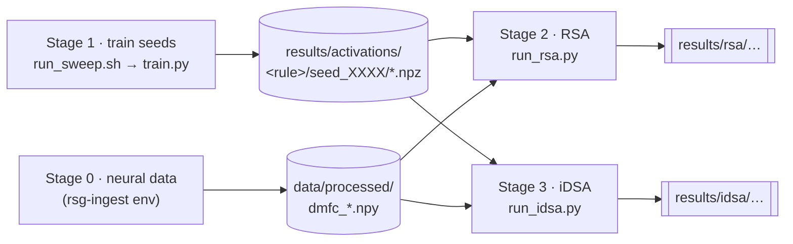

# RUNBOOK — full training + comparison run

How to take the two-prior RSG pipeline end to end: train BPTT and PC seeds, extract
latents, and compare each to macaque DMFC with RSA (geometry) and iDSA (dynamics).
Seeds are the unit of evidence — always run several per rule.



## Environments

Three conda envs, joined only by files on disk (AGENTS.md "Dependency fragility").

| Env | Has | Used for |
| --- | --- | --- |
| `rsg-ingest` | dandi, pynwb, nlb_tools (numpy<2, pandas<2) | **Stage 0** neural ingestion only |
| **`rsg`** | torch 2.2.2, **neurogym**, **rsatoolbox**, matplotlib | **Stages 1–3** train + compare — *use this* |
| `base` | torch only (no neurogym/rsatoolbox) | fallback; needs `--task-source standalone` |

Run every command **from the repo root**. For Stages 1–3: `conda activate rsg`.

---

## Stage 0 — neural data (already done)

The DMFC tensors already exist in `data/processed/` (`dmfc_rsg.npy`,
`dmfc_inputs.npy`, `dmfc_rsg_splits.npy`, `dmfc_meta.json`). To regenerate:

```bash
conda activate rsg-ingest
python -m src.data.build_neural --out-dir data/processed      # ~1 min; downloads DANDI:000130 if absent
```

`data/raw/` and `data/processed/*.npy|json` are gitignored (regenerable).

## Stage 1 — train seeds  (`conda activate rsg`)

One seed per invocation; `scripts/run_sweep.sh` loops rules × seeds (the local
equivalent of a SLURM job array). Each seed is independent — a failure doesn't abort
the sweep; failures are listed at the end to re-run.

**Reduced smoke first** — CPU, fast, *under-trains on purpose* (flat behavior/weak
signal is expected here; the point is to validate the whole pipeline plumbs through):

```bash
bash scripts/run_sweep.sh --regime reduced --rules "bptt pc" --seeds "0 1 2 3 4"
```

**Faithful run** — real results; `dt=1, N=200`, big iter budget, wants a **GPU**
(hours). Pins hyperparameters from `configs/<rule>.yaml`:

```bash
bash scripts/run_sweep.sh --config-dir configs --rules "bptt pc" --seeds "$(seq 0 9)"
```

Notes: PC is slower than BPTT (inner inference loop). Default task source is
`neurogym`; add `--task-source standalone` for the byte-identical numpy generator (or
if running in `base`). Test the loop without training via `... --regime reduced -- --dry-run`.

**Writes:** `results/runs/<rule>/seed_XXXX/` (config.yaml + checkpoints) and the
activation store `results/activations/<rule>/seed_XXXX/<condition_key>.npz` (20 files
per seed — states + inputs + `tp`).

## Stage 2 — RSA (representational geometry) vs DMFC

```bash
python scripts/run_rsa.py --store results/activations --seeds 0 1 2 3 4 \
    --neural data/processed/dmfc_rsg.npy
```

Pass the **same seeds you trained**. The neural noise-ceiling band is auto-loaded from
the sibling `dmfc_rsg_splits.npy`. Drop `--neural` for a BPTT-vs-PC rule-vs-rule check.

**Writes:** `results/rsa/rsa_distances.json` and
`results/rsa/figures/summary_distance_to_dmfc.png` (per-seed distance to DMFC per rule,
with the noise-ceiling band).

## Stage 3 — iDSA (input-driven dynamics) vs DMFC — the headline

```bash
python scripts/run_idsa.py --store results/activations --seeds 0 1 2 3 4 \
    --neural data/processed/dmfc_rsg.npy --neural-inputs data/processed/dmfc_inputs.npy \
    --backend builtin
```

`--neural-inputs` is required (iDSA compares input-driven dynamics). `--backend
builtin` uses the numpy iDSA implementation (no extra install); omit it to try the
official `dsa-metric` package, which falls back to builtin with a warning if it isn't
in a separate env (see `requirements-idsa.txt`). Neural is partially observed, so the
neural operators are fit with `method=subspace` automatically. Drop `--neural*` for a
rule-vs-rule check (JSON only).

**Writes:** `results/idsa/idsa_distances.json` and
`results/idsa/figures/summary_distance_to_dmfc.png` (model-to-DMFC mode).

---

## Where everything lands

| Path | What |
| --- | --- |
| `data/processed/dmfc_*.npy \| .json` | neural states, inputs, split-halves, meta (Stage 0) |
| `results/runs/<rule>/seed_XXXX/` | per-seed `config.yaml` + checkpoints |
| `results/activations/<rule>/seed_XXXX/<cond>.npz` | the store: states + inputs + `tp` (20/seed) |
| `results/rsa/rsa_distances.json` · `.../figures/*.png` | RSA distances + summary figure |
| `results/idsa/idsa_distances.json` · `.../figures/*.png` | iDSA distances + summary figure |
| `results/figures/<name>/` | optional per-net diagnostics (`scripts/plot_bptt_activity.py`) |

## Gaps & coordination (read before the first real run)

1. **PC training is numerically unstable in the reduced regime — the current blocker
   for a PC-vs-BPTT run.** As of the smoke below, PC (`src/models/pc_rnn.py`
   `infer_and_update`) diverges to non-finite within ~7–10 iterations across seeds;
   lowering `pc_inference_lr` (0.1→0.02) or `lr` (1e-3→2e-4) doesn't fix it (points at
   the local-update direction/scale, not a hyperparameter). **BPTT trains and runs the
   full pipeline end to end.** Owned by the PC track. Note the trainer's PC test only
   covers a 1-iteration `N=8` config, so it does not catch this.
2. **Behavior Fig 1E** — the trainer now computes tp-vs-ts slopes and per-condition
   `tp` into each seed's `metrics.json` (`behavior_slopes`, `behavior_by_condition`),
   so the *data* exists; only a figure runner over the store is still missing. Behavior
   is a *reported covariate* — carry it alongside, never gate seeds on it (AGENTS.md).
3. **Official DSA backend** (optional) lives in its own env (`requirements-idsa.txt`);
   it is installed in `rsg` and agrees with `--backend builtin` (see
   `tests/test_idsa_backends.py`), so either backend is fine.

*Resolved:* the trainer (`train_one_seed`) is implemented and restart-safe
(commit `04b1440`), and the store-path seam is closed — `scripts/train.py` defaults the
activation store to `results/activations` (`--run-dir`'s sibling), exactly what Stages
2–3 read. Verified end to end for BPTT: sweep → 20-condition store → RSA + iDSA
model-to-DMFC → JSON + figures.

## Smoke checklist (fastest end-to-end path)

```bash
conda activate rsg
bash scripts/run_sweep.sh --regime reduced --rules "bptt pc" --seeds "0"     # ~minutes
ls results/activations/bptt/seed_0000/*.npz | wc -l                          # expect 20
python scripts/run_rsa.py  --store results/activations --seeds 0 --neural data/processed/dmfc_rsg.npy
python scripts/run_idsa.py --store results/activations --seeds 0 --backend builtin \
    --neural data/processed/dmfc_rsg.npy --neural-inputs data/processed/dmfc_inputs.npy
# -> results/{rsa,idsa}/*.json + .../figures/summary_distance_to_dmfc.png
```

Then scale seeds up (≥5) for a spread. The neural half of Stages 2–3 is already
validated end-to-end (Preprocessor → operators → `input_dsa`, noise ceiling).
