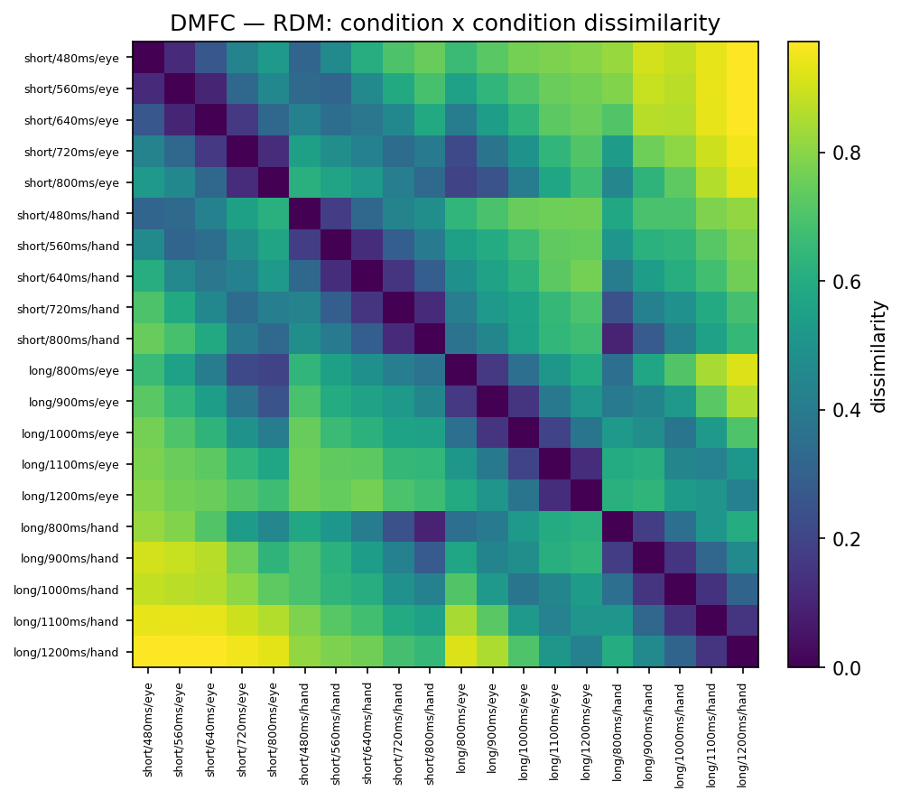
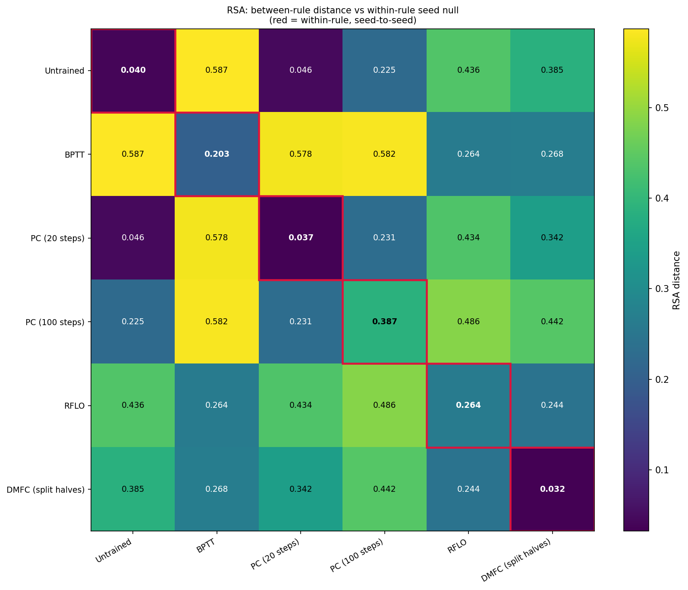
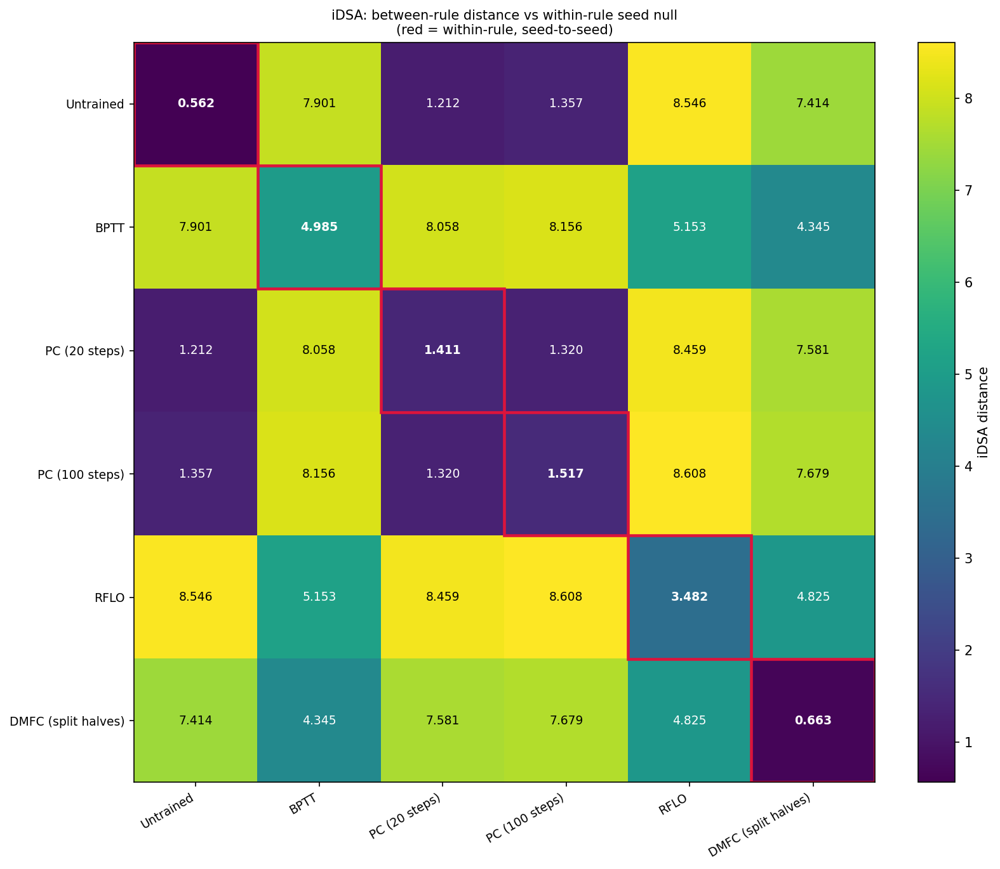
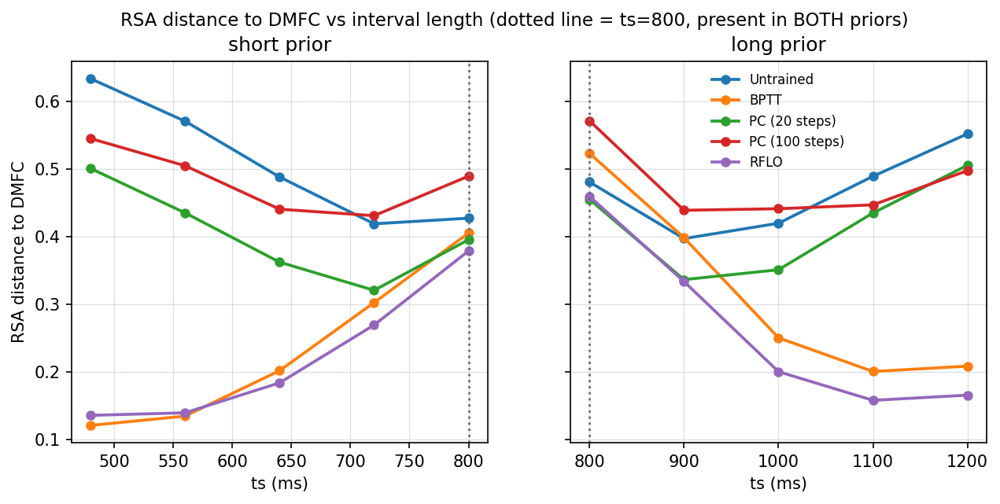
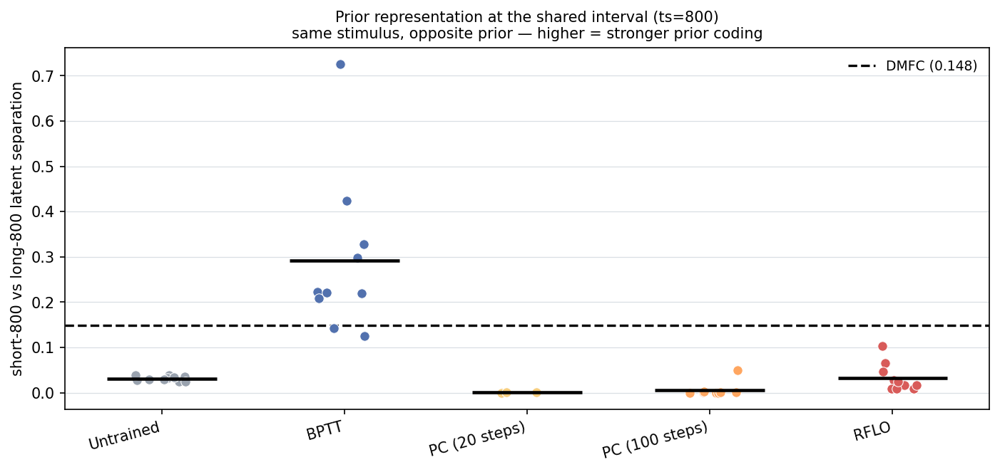
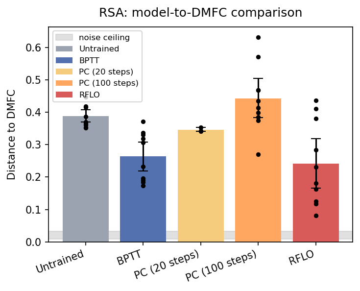
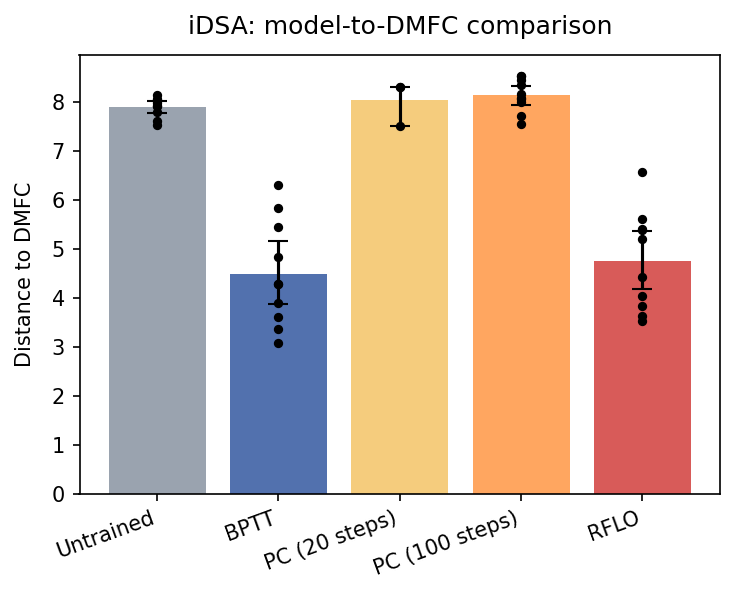
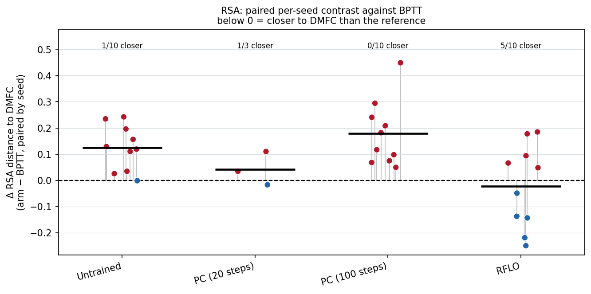

# Results, slide by slide

One question drives the whole set: does the learning rule leave a measurable signature on
latent geometry (RSA) and dynamics (iDSA), and which rule sits closer to macaque DMFC? The
architecture is fixed across arms (BPTT, PC at 20 and 100 inference steps, RFLO, plus an
untrained control), so any difference is the rule, not the network.

Each figure below has a one-line "what it shows", the number that matters, and a sentence
you can say out loud. All arm colors and the heatmap ramp come from one shared scheme
(`src/viz/palette.py`): BPTT blue, PC(20) yellow, PC(100) orange, RFLO red, untrained gray;
heatmaps run blue (near) to red (far).

## If you only have 60 seconds

You cannot walk all six. Show three:

1. **RQ3 headline** (25s): who is closest to the brain.
2. **RQ2 overlap-800** (20s): brain-similarity and prior coding are not the same thing.
3. Open on **Setup** (5s) and close on the one-line takeaway (10s).

Takeaway line: "Overall similarity to DMFC and actually coding the prior come apart. RFLO
matches the brain as well as BPTT overall, yet only BPTT represents the prior."

## Setup: the 20-condition schema

**What it shows:** the 20 task conditions (ts x prior x effector) and DMFC's own geometry
over them. Model and neural data pass through the same preprocessing before any comparison,
so distances later are comparable.

**Say:** "Everything is measured against these 20 conditions, with identical preprocessing
on both sides."

Note: this heatmap and the per-arm RDM galleries still need `data/processed/` present to
redraw in the shared palette (see the README). The figure above is the earlier version.

## RQ1 geometry: is there a signature at all?

**What it shows:** an arm-by-arm RSA distance matrix. The red-ringed diagonal is the
within-rule, seed-to-seed distance (the null). An off-diagonal pair only counts as a
signature if it clears that null.

**Number:** BPTT-vs-PC (0.578) sits far above the within-rule null (BPTT 0.203), so it
clears. BPTT-vs-RFLO (0.264) does not stand out from it. DMFC's own split-half floor is
0.032.

**Say:** "BPTT and PC have a real geometric difference. BPTT and RFLO do not."

## RQ1 dynamics: same test, for temporal structure

**What it shows:** the same within-vs-between matrix for iDSA (input-driven dynamics).

**Number:** BPTT's distance to DMFC is 4.345, which is below BPTT's own seed-to-seed spread
of 4.985. BPTT seeds differ from each other more than the average seed differs from the
brain.

**Say:** "On dynamics, BPTT is closer to DMFC than it is to its own other seeds."

## RQ2: does interval length or prior change the answer?

**What it shows:** distance to DMFC as a continuous function of interval length, per prior,
instead of two coarse bands. BPTT and RFLO fit DMFC best at intervals away from the prior
boundary and worst near 800 ms.

**What it shows:** ts=800 is the one interval present in both priors, so the same physical
stimulus carries opposite prior context. How far apart a network holds short-800 and
long-800 is a direct read of prior coding.

**Number:** only BPTT separates the two priors (0.292, above DMFC's own 0.148). RFLO 0.033,
PC(100) 0.006, PC(20) 0.001, untrained 0.031 are all effectively flat.

**Say:** "This is the sharpest result. Only BPTT encodes the prior, even though RFLO looks
just as brain-like overall. Similarity and prior coding come apart."

## RQ3 headline: who is closest to DMFC?

**What it shows:** distance to DMFC per arm, one point per seed, 95% bootstrap CIs, the
untrained control for a floor, and the neural noise-ceiling band. Arms are ordered along the
locality axis.

**Numbers:** RSA means RFLO 0.241, BPTT 0.264, PC(20) 0.346, untrained 0.389, PC(100) 0.442.
iDSA means BPTT 4.49, RFLO 4.76, then untrained 7.89 and both PC arms near 8.0.

**Say:** "RFLO and BPTT sit closest on both measures. Both PC arms are at or past the
untrained control, so more PC inference steps did not help."

## RQ3 paired: seed for seed against BPTT

**What it shows:** seed N of every arm starts from bit-identical weights, so the comparison
to BPTT is paired and initialization variance drops out. Points below zero are seeds closer
to DMFC than BPTT.

**Number:** on RSA, PC(100) is 0/10 closer than BPTT and RFLO is 5/10. On iDSA, PC(100) is
0/10 and RFLO is 4/10.

**Say:** "Paired seed for seed, PC never beats BPTT. RFLO is a genuine coin flip against it."

## How these were made

The RQ1 to RQ3 figures are drawn from cached metrics (`results/signature/signature.json`)
by `scripts/plot_slide_figures.py`, which retrains nothing. The behavior-and-loss figure
(`results/figures/results_summary.png`) comes from `scripts/plot_results_summary.py`. See the
README section "Results figures" for the regenerate commands and the shared color module.
